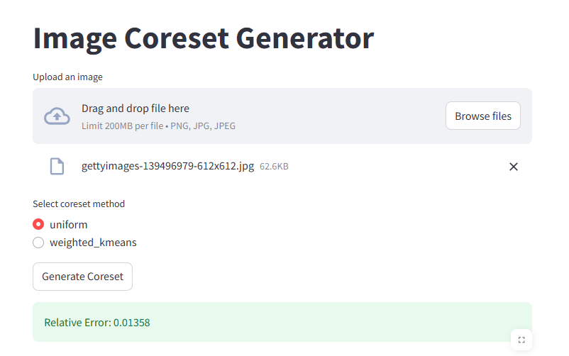
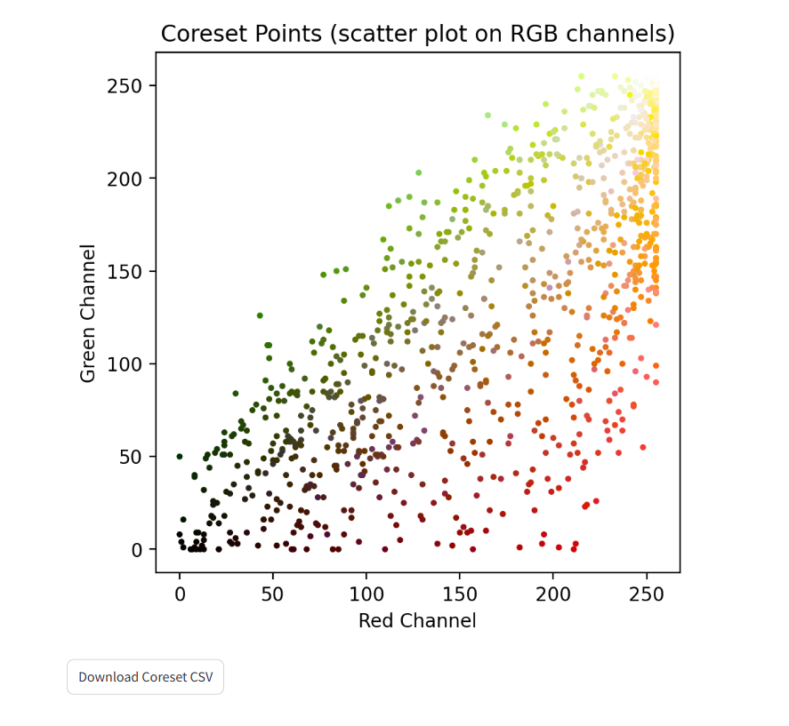

# Image Coreset Generator

Coresets are compact, representative subsets of large datasets that retain critical information while significantly reducing data size. This enables faster computations and efficient data processing without compromising much on accuracy, making coresets invaluable for scaling complex tasks.

We also demonstrate the application of coresets to image segmentation. You can explore our results on this problem in the related repository: [Coresets for Image Segmentation](https://github.com/OnePunchMonk/Coresets-for-Image-Segmentation).

---

## Tech Stack

| Technology       | Purpose                                |
|------------------|--------------------------------------|
| Python 3.9+      | Core programming language             |
| FastAPI          | Backend API framework                 |
| Uvicorn          | ASGI server for running FastAPI apps |
| Streamlit        | Interactive frontend UI               |
| Pillow           | Image loading and processing          |
| NumPy            | Numerical and array operations        |
| scikit-learn     | Clustering algorithms and utilities   |
| python-multipart | File upload handling in FastAPI       |
| pandas           | Data manipulation and CSV export      |
| matplotlib       | Visualization and plotting             |
| requests         | HTTP communication between frontend and backend |

---

## Project Overview

This tool allows users to upload images and generate coresets via different sampling methods. The generated coresets provide a lightweight representation of image data useful for downstream tasks like segmentation and clustering. The app displays coreset points visually alongside quantitative error metrics to evaluate performance.

---
## Performance

- **Speed**: The coreset method significantly improves processing speed by reducing the number of data points, making the algorithm faster even for large images.
- **Memory Efficiency**: By reducing the size of the dataset, the algorithm requires less memory, which is particularly beneficial for high-resolution images.

